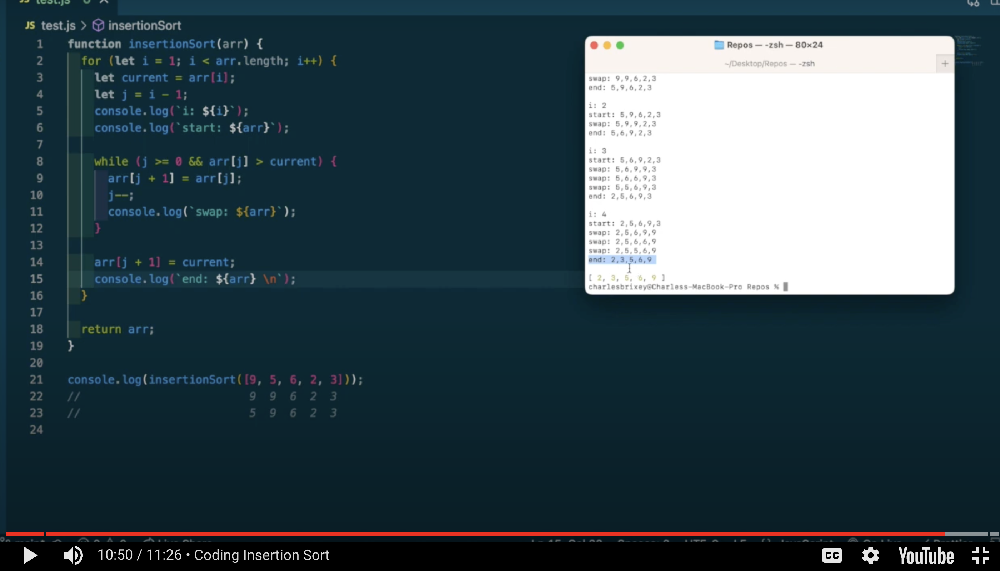

# Independent Learning Project - Insertion Sort

## Introduction

Insertion sort is a sorting algorithm that sorts an array by inserting each element in it's correct position in a sorted sub-list. It works by comparing each element with the previous elements and then moving the elements to its correct position by shifting it to the right. 

## Algorithm Description

Step 1. 
```js
for (let i = 1; i < arr.length; i++) {  //Here we use a traditional for loop to iterate over an array with i initialized to index 1 instead of 0.
```

Step 2.
```js 
let currentValue = arr[i]; //Here we assign arr[i] to the variable currentValue. This is an important step because when we find the number before our current index is greater than our current index the previous index becomes the current index (as seen on line 7), so we initialize a variable and set it to the value of our current index so that it's saved and we can use it later
```

Step 3.
```js 
let j = i - 1; //j is initialized to i - 1 here to have the index that we are comparing our currentValue too.
```

Step 4.
```js 
while (j >= 0 && arr[j] > currentValue) { //We start a while loop here to implement our logic that once our index j is a valid index and our value at index j is greater than our current value, we want to replace the value at the index in front of j with the value of j. 
```

Step 5.
```js 
arr[j + 1] = arr[j]; //The update of values if our while loop is true happens here.
```

Step 6.
```js 
j--; //We decrement j here to continue checking through our already sorted elements to make sure our currentValue is in the correct place. } 
```

Step 7.
```js 
arr[j + 1] = currentValue; //Once our while loop is completed we take our currentValue that is "floating" in our saved variable and assign it to the index in front of j. }
```



Step 8.
```js 
return arr; //Here we return our newly sorted arr. };
```


## Big O Evaluation

### Time Complexity
```js
//The time complexity of the Insertion Sort algorithm is O(n^2) in the worst case, and O(n) in the best case.
```


### Space Complexity

## Use Cases
```js
//Insertion Sort is optimal for smaller sized inputs because as the input size increases the algorithm's running time also increase rapidly. 
//Insertion Sort is a stable sorting algorithm that maintains the relative order of equal elements.
```

## Edge Cases and Concerns
```js
//Although Insertion sort is optimal when being used on small input sizes, when the input size grows to larger varieties insertion sort is not the best algorithm to use. 
//Also in cases when when the array is in descending order, since the insertion sort has to go through each element and check it against each element before it every time. This can make your time complexity skyrocket and should prompt you to try another method!
```
## Citations

